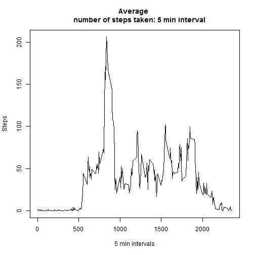

Reproducible Research: Peer Assessment 1
========================================================


## Loading and preprocessing the data

```r
data <- read.csv("activity.csv", header = TRUE)
data$date <- as.Date(data$date)
data$steps <- as.numeric(data$steps)
```


## What is mean total number of steps taken per day?

```r
# Aggregate data, steps by day
aggdata <- aggregate(data$steps ~ data$date, data = data, FUN = sum, nar.rm = F)
hist(aggdata[, 2], xlab = "Steps", main = "Total number of steps taken each day")
```

 

```r
# Mean of steps per day
mean(aggdata[, 2], na.rm = TRUE)
```

```
## [1] 10766
```

```r
# Median of steps per day
median(aggdata[, 2], na.rm = TRUE)
```

```
## [1] 10765
```


## What is the average daily activity pattern?

```r
# Aggreagate data, steps by interval
aggdata2 <- aggregate(data$steps ~ data$interval, data = data, FUN = mean, na.rm = T)
plot(aggdata2, type = "l", xlab = "5 min intervals", ylab = "Steps", main = "Average number of steps taken: 5 min interval")
```

 

```r
# Which 5-minute interval, on average across all the days in the dataset,
# contains the maximum number of steps?
aggdata2[, 1][which.max(aggdata2[, 2])]
```

```
## [1] 835
```


## Imputing missing values

```r
# Number of rows with NA
sum(is.na(data))
```

```
## [1] 2304
```

```r
# Replace NA with the mean from the corresponding interval
for (i in 1:nrow(data)) {
    if (is.na(data$steps[i])) {
        data$steps[i] <- aggdata2[which(aggdata2[, 1] == data$interval[i]), 
            2]
    }
}
# Create a new dataset with missin values fillen in
data2 <- data
# Histogram, mean and median
aggdata <- aggregate(data2$steps ~ data2$date, data = data2, FUN = sum, nar.rm = F)
hist(aggdata[, 2], xlab = "Steps", main = "Total number of steps taken each day: imputing missing values")
```

 

```r
# Mean
mean(aggdata[, 2], na.rm = TRUE)
```

```
## [1] 10766
```

```r
# Median
median(aggdata[, 2], na.rm = TRUE)
```

```
## [1] 10766
```

```r
### After substitution of NA values with the mean the central bins of the
### distribution tend to increase, mainly because using the mean reinforces
### only the most common values. However the mean and the median remain almost
### identical.
```


## Are there differences in activity patterns between weekdays and weekends?
### Create factor variable with two labels: weekday or weekend.

```r
weekend <- c("Saturday", "Sunday")
data2$daytype <- NA
data2$daytype[weekdays(data2$date) %in% weekend] <- "weekend"
data2$daytype[is.na(data2$daytype)] <- "weekday"
data2$daytype <- as.factor(data2$daytype)
```


### Time series plot  of the 5-minute interval  and the average number of steps taken, averaged across all weekday days or weekend days . 

```r
library(lattice)
aggdata3 <- setNames(aggregate(data2$steps ~ data2$interval + data2$daytype, 
    data = data2, FUN = sum, nar.rm = F), c("interval", "daytype", "steps"))
xyplot(steps ~ interval | daytype, data = aggdata3, type = "l", xlab = "Interval", 
    ylab = "Number of steps", layout = c(1, 2))
```

 

